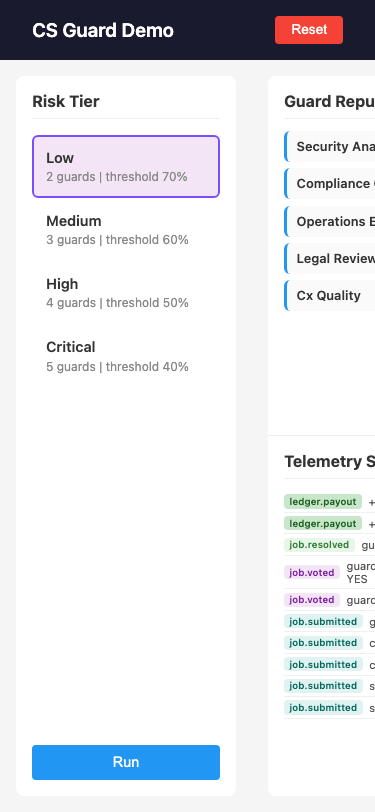
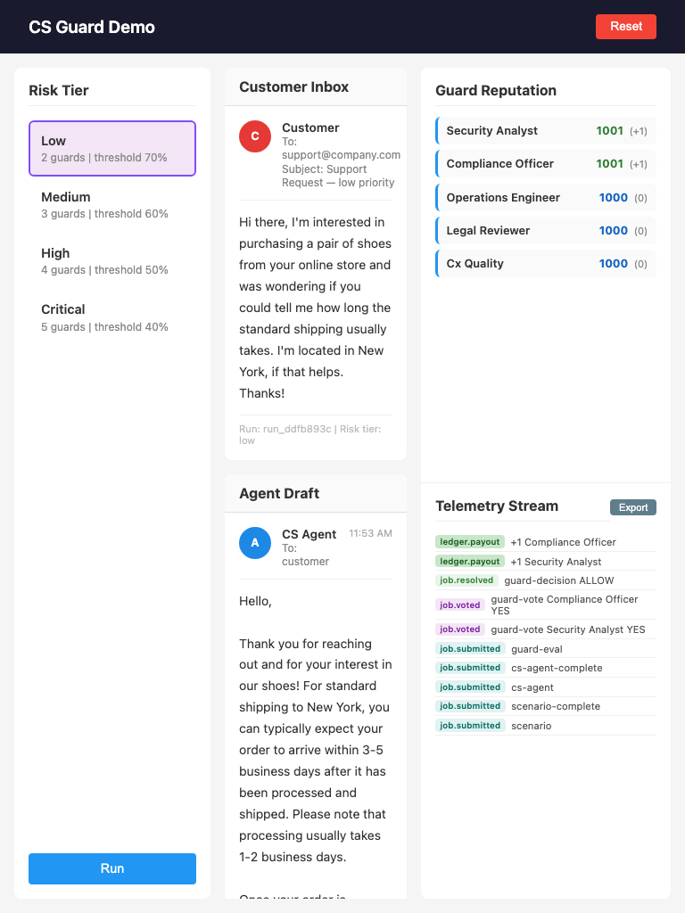

# QA Report: CS Guard Demo

| Field | Value |
|-------|-------|
| **Date** | 2026-03-15 |
| **URL** | http://localhost:3000 |
| **Scope** | Full app |
| **Mode** | full |
| **Duration** | ~12 minutes |
| **Pages visited** | 1 (SPA) |
| **Screenshots** | 14 |
| **Framework** | Express + vanilla JS SPA |

## Health Score: 78/100

| Category | Score |
|----------|-------|
| Console | 100 |
| Links | 100 |
| Visual | 92 |
| Functional | 100 |
| UX | 85 |
| Performance | 92 |
| Content | 100 |
| Accessibility | 75 |

## Top 3 Things to Fix

1. **ISSUE-001: Mobile layout completely broken** — 3-column grid doesn't collapse; center column invisible on mobile
2. **ISSUE-002: Tier cards not keyboard accessible** — Divs with onclick but no tabindex/role; can't tab or activate with keyboard
3. **ISSUE-003: Excessive reputation API calls** — Every SSE ledger event triggers a redundant fetch; ~50 duplicate calls per run

## Console Health

| Error | Count | First seen |
|-------|-------|------------|
| (none) | 0 | — |

## Summary

| Severity | Count |
|----------|-------|
| Critical | 0 |
| High | 1 |
| Medium | 2 |
| Low | 1 |
| **Total** | **4** |

## Issues

### ISSUE-001: Mobile layout completely broken

| Field | Value |
|-------|-------|
| **Severity** | high |
| **Category** | visual |
| **URL** | http://localhost:3000 |

**Description:** The 3-column CSS grid uses fixed column widths (`220px 1fr 280px`) with no responsive breakpoints. On mobile (375px), the center column is pushed off-screen entirely. The left tier panel and right reputation panel overlap/squish together with truncated text. The app is completely unusable below ~800px.

**Repro Steps:**

1. Navigate to http://localhost:3000
2. Set viewport to 375x812 (iPhone)
   
3. **Observe:** Center column (Customer Inbox, Agent Draft, Guard Decision) is invisible. Left and right panels overlap with truncated text ("Guard Repu...", "Security Ana...").

---

### ISSUE-002: Tier cards not keyboard accessible

| Field | Value |
|-------|-------|
| **Severity** | medium |
| **Category** | accessibility |
| **URL** | http://localhost:3000 |

**Description:** Risk tier selection cards are `
` elements with inline `onclick` handlers but no `tabindex`, `role`, or `aria-*` attributes. Users navigating with keyboard cannot tab to or activate tier cards. Screen readers don't announce them as interactive elements.

**Repro Steps:**

1. Navigate to http://localhost:3000
2. Press Tab repeatedly to cycle through focusable elements
3. **Observe:** Focus jumps from Reset button to Run button, skipping all four tier cards entirely. No keyboard path to select a tier.

---

### ISSUE-003: Excessive reputation API calls

| Field | Value |
|-------|-------|
| **Severity** | low |
| **Category** | performance |
| **URL** | http://localhost:3000 |

**Description:** `refreshReputation()` is called on every SSE `ledger.*` event and also after each stage reveal step. A single run generates 5-15 rapid-fire `GET /api/reputation` requests within milliseconds of each other, all returning identical data. Should debounce or batch these calls.

**Repro Steps:**

1. Navigate to http://localhost:3000
2. Select any tier and click Run
3. Open network tab
4. **Observe:** 10+ duplicate `GET /api/reputation` requests fire in quick succession during the staged reveal and after telemetry events.

---

### ISSUE-004: No responsive breakpoint for tablet

| Field | Value |
|-------|-------|
| **Severity** | medium |
| **Category** | visual |
| **URL** | http://localhost:3000 |

**Description:** At tablet width (768px), the 3-column layout renders but is very cramped. Center column content is narrow, email text wraps heavily, and the right panel text truncates. While technically functional, the reading experience is poor. A media query to stack columns below ~1024px would improve usability significantly.

**Repro Steps:**

1. Navigate to http://localhost:3000
2. Set viewport to 768x1024
   
3. **Observe:** All three columns render but are cramped. Center column has ~250px of usable width for email content.

---
